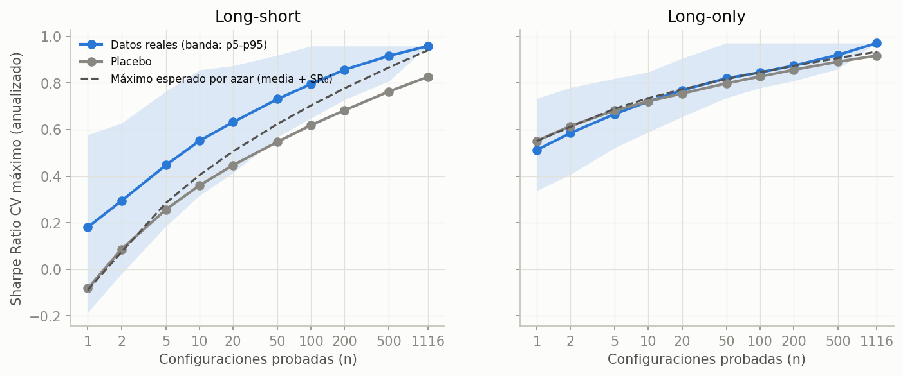
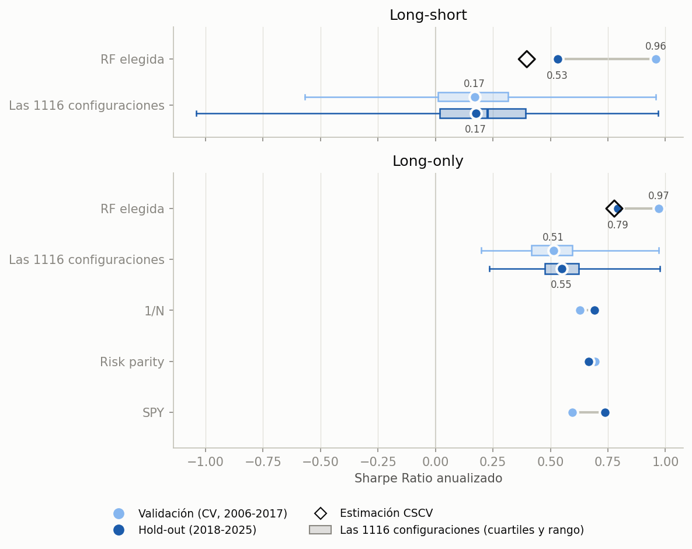
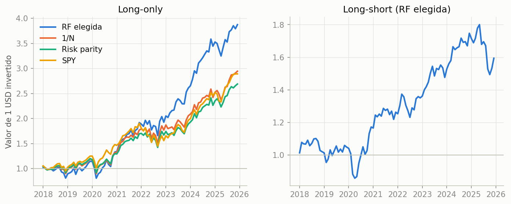
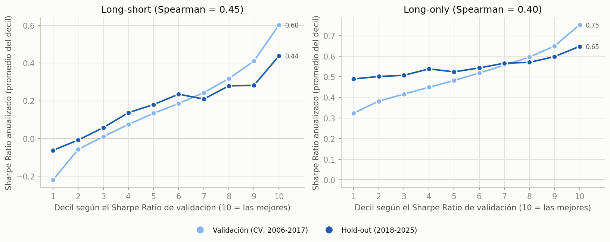
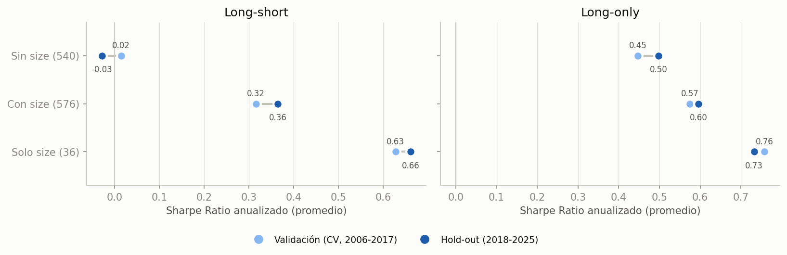
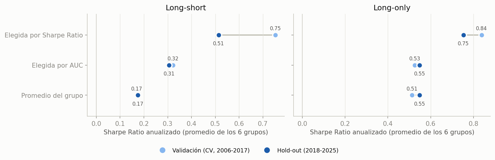

# Resultados

Experimento de [plan.md](../plan.md), implementado en [run_experiment.ipynb](../run_experiment.ipynb). Se probaron 1116 configuraciones de Random Forest (subconjunto de features × h × cuantil × profundidad × hojas) con purged K-fold y embargo sobre 2006–2017, y se eligió la mejor por Sharpe Ratio de validación. Recién después se evaluó el hold-out 2018–2025, una sola vez (3 de octubre de 2026). El placebo no se corrió.

En las figuras 7 a 10, el azul claro es validación (CV, 2006–2017) y el oscuro, hold-out (2018–2025). Todas las tablas y figuras están en `results/fa3e6998e744_full/`.

## En pocas palabras

- **Elegir la mejor infla el Sharpe Ratio, aunque la validación esté bien hecha.** La elegida LS tenía Sharpe Ratio 0.96 en la CV y 0.53 en el hold-out. El promedio de las configuraciones no cayó (0.17 y 0.17), así que la caída es sesgo de selección.
- **El DSR y la CSCV lo anticiparon.** El DSR de la elegida daba 0.80, no significativo. La CSCV estimaba un Sharpe Ratio fuera de muestra de 0.40, mucho más cerca del 0.53 real que el 0.96 de la CV.
- **La elegida no era puro ruido.** El ranking de la CV anticipa en parte el del hold-out (Spearman 0.45 en LS), y la elegida quedó en el puesto 112 de 1116. La señal viene casi toda de `size`, y la elegida compra AAPL en todos los rebalanceos del hold-out.
- **La configuración típica pierde contra los baselines.** En long-only, el promedio de las configuraciones tiene Sharpe Ratio 0.55 en el hold-out, contra 0.69 de 1/N. La elegida le gana (0.79), pero por mucho menos que en la CV (0.97 contra 0.63). Además, en la CV esa ventaja no era significativa (ver la tabla del long-only contra 1/N).
- **Elegir por AUC no evita el problema.** La estimación no se infla, pero la configuración elegida es peor: en 11 de 12 casos rinde menos en el hold-out que la elegida por Sharpe Ratio.

## 1. Cuánto Sharpe Ratio da elegir la mejor

- El Sharpe Ratio máximo de la CV crece con la cantidad de configuraciones probadas, igual que el máximo esperable solo por la dispersión entre configuraciones (media + $SR_0(n)$). La elegida LS queda casi justo sobre esa curva: 0.96 contra 0.93.
- El DSR no compara a la elegida contra 0, sino contra $SR_0$: el máximo que darían, sin señal, tantos intentos como el N efectivo de las 1116 configuraciones (464 en LS, con $SR_0$ = 0.70 anual). Contra esa vara, la elegida LS da DSR 0.80, debajo de 0.95. La long-only se evalúa contra 1/N, en su propia tabla al final.

## 2. La elegida en el hold-out

| Sharpe Ratio anualizado | LS | LO |
|---|---:|---:|
| Elegida en la CV | 0.96 | 0.97 |
| Estimación CSCV (rombo) | 0.40 | 0.78 |
| **Elegida en el hold-out** | **0.53** | **0.79** |
| Promedio de las configuraciones: CV → hold-out | 0.17 → 0.17 | 0.51 → 0.55 |
| 1/N: CV → hold-out | | 0.63 → 0.69 |
| Caída atribuible a la selección | 0.43 | 0.21 |
| Puesto de la elegida en el hold-out (de 1116) | 112 | 20 |

- En la fila de las 1116 configuraciones, las cajas muestran su distribución (cuartiles y mediana; bigotes del mínimo al máximo) y los puntos, el promedio. La elegida es justo el máximo de la caja de validación.
- La caída atribuible a la selección es la caída de la elegida menos la del promedio. En LS es toda la caída: el promedio no se movió.
- La estimación CSCV (el Sharpe Ratio fuera de muestra promedio de la campeona en cada partición) fue la mejor predicción del hold-out. Estima lo que rinde el procedimiento de elegir la mejor, no una configuración en particular. La CV sola sobrestimó el Sharpe Ratio de la elegida en 0.43 (LS) y 0.18 (LO).
- La elegida igual quedó entre las mejores del hold-out. Elegir por la CV no la llevó a una configuración mala; lo que se infló fue la estimación.

## 3. La CV ordena, pero las mejores están infladas

- El plan esperaba un Spearman cercano a 0 entre el ranking de la CV y el del hold-out. Dio 0.45 en LS y 0.40 en LO, así que la CV ordena algo. Los p-valores suponen configuraciones independientes, y no lo son.
- Pero la mejora se achica justo arriba. El 10% mejor pasa de 0.60 a 0.44 en LS, y de 0.75 a 0.65 en LO. El 10% peor mejora: es regresión a la media, y cuanto más extremo es el valor en la CV, más vuelve hacia el promedio en el hold-out.
- Lo mismo pasa entre grupos. Con h = 6, el Sharpe Ratio LS promedio era el mejor en la CV (0.24 contra 0.13 con h = 1) y fue el peor en el hold-out (0.06 contra 0.17 con h = 1 y 0.30 con h = 3). La elegida global sale de ese grupo.

## 4. La señal es `size`, y en parte es AAPL

- Sin `size`, el long-short no gana nada (0.02 en la CV y −0.03 en el hold-out), y el long-only queda debajo de 1/N (0.45 y 0.50, contra 0.63 y 0.69). Las que usan solo `size` mantienen el Sharpe Ratio en los dos períodos: 0.63 → 0.66 en LS y 0.76 → 0.73 en LO. El efecto persistió.
- Las elegidas (LS y LO) usan `size` como única feature. En general, compran las acciones de menor volumen en dólares y venden las de mayor volumen (Spearman entre −0.4 y −0.6 entre la predicción y el rank de `size`), con una excepción fija: AAPL está en la pata larga en el 92% de los rebalanceos de la CV y en el 100% del hold-out. En el hold-out, MSFT también está en el 94%.
- Con un universo fijo de 40 acciones sobrevivientes, `size` funciona en parte como identificador de cada acción. Una parte del buen hold-out puede venir de AAPL y MSFT, más que de una regla general (detalle en `size_elegidas.csv`).

## 5. Sharpe Ratio o AUC para elegir

- La elegida por AUC no se infla (0.32 → 0.31 en LS) porque no se eligió mirando el Sharpe Ratio, pero rinde menos.
- La elegida por Sharpe Ratio se infla (0.75 → 0.51 en LS), pero rinde más en el hold-out en 11 de los 12 casos (6 grupos × LS/LO). La única excepción es h = 6, q = 3 en LS, donde las dos terminan cerca de 0.
- El detalle por grupo está en `tabla_criterios.csv`.

## Tabla principal

| Estrategia | Sharpe Ratio CV | Sharpe Ratio hold-out | DSR (CV) | PBO | PSR hold-out |
|---|---:|---:|---:|---:|---:|
| RF elegida (LS) | 0.96 | 0.53 | 0.80 | 0.17 | 0.93 |
| RF elegida (LO) | 0.97 | 0.79 | 0.98 | 0.06 | 0.98 |
| Promedio de las configuraciones (LS) | 0.17 | 0.17 | | | |
| Promedio de las configuraciones (LO) | 0.51 | 0.55 | | | |
| 1/N | 0.63 | 0.69 | 0.98 | | 0.97 |
| Risk parity | 0.69 | 0.67 | 0.99 | | 0.97 |
| SPY | 0.60 | 0.74 | 0.97 | | 0.98 |

- Los Sharpe Ratio están anualizados y netos de costos. El LO se mide sobre el exceso respecto del T-bill y el LS, sobre el retorno directo.
- Para los baselines, el DSR es el PSR, porque son un solo intento.
- El DSR del LO contra el T-bill (0.98) mide sobre todo la prima de mercado: 1/N, sin ninguna búsqueda, ya da 0.98. La comparación que mide habilidad es la del long-only contra 1/N, en la tabla siguiente.
- En el hold-out, solo el 11% de las configuraciones long-only le gana a 1/N en Sharpe Ratio.

## Long-only contra 1/N (information ratio)

El information ratio (IR) es el Sharpe Ratio de la diferencia de retornos LO − 1/N: mide cuánto le gana la cartera a 1/N por unidad del riesgo que toma al alejarse de 1/N. Es una medida distinta del Sharpe Ratio, por eso va en una tabla aparte.

| Estrategia | IR CV | IR hold-out | DSR (CV) | PBO | PSR hold-out |
|---|---:|---:|---:|---:|---:|
| RF elegida por IR | 1.01 | 0.52 | 0.86 | 0.17 | 0.93 |
| Promedio de las configuraciones (LO) | 0.18 | 0.09 | | | |
| Risk parity | −0.09 | −0.58 | | | |
| SPY | −0.42 | −0.07 | | | |

- La elegida por IR es la misma configuración que la elegida por Sharpe Ratio en long-only.
- Su DSR, calculado sobre el retorno activo con su propio N efectivo (524), es 0.86: la ventaja sobre 1/N no era significativa. La CSCV estimaba un IR fuera de muestra de 0.45, y en el hold-out dio 0.52.

## Limitaciones

- **Sin placebo:** la curva teórica de la figura 1 usa la varianza de las configuraciones reales, así que no separa el ruido de las diferencias reales entre configuraciones.
- **Universo de sobrevivientes:** son 40 acciones fijas que cotizaron todo el período. Eso favorece que `size` funcione como identificador y puede explicar parte del peso de AAPL.
- **Hold-out corto:** con 8 años, el PSR de la elegida LS en el hold-out es 0.93. Tampoco alcanza para declararla significativa.
- **Figuras 7 a 10:** son descriptivas y se agregaron después de ver la validación. No cambian ninguna selección.
