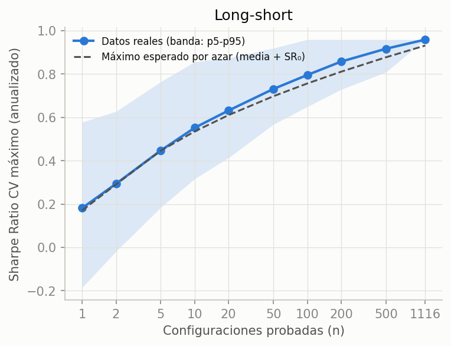
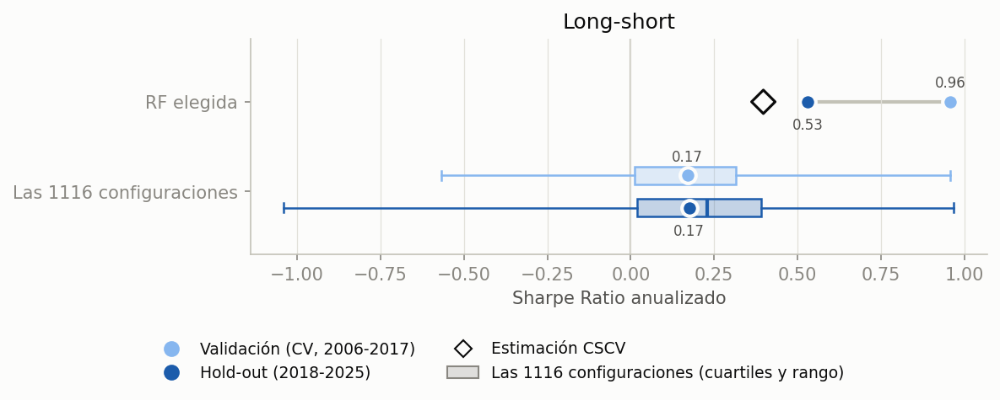
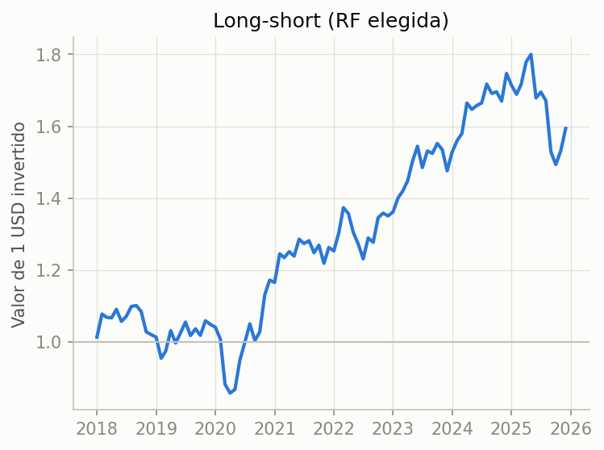
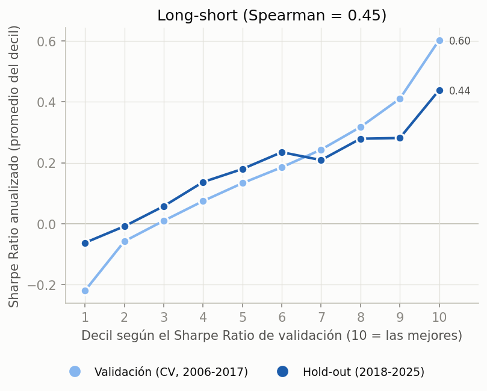
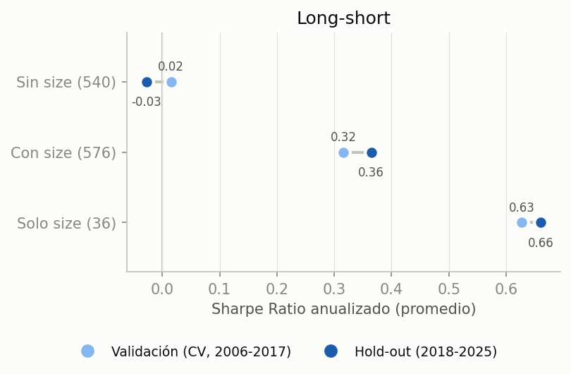
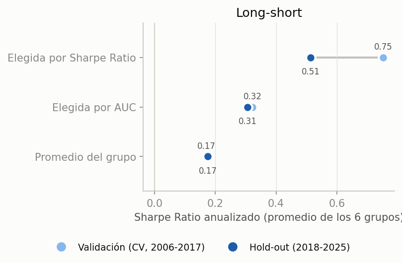

# Resultados: long-short

Versión de [resultados.md](resultados.md) solo con la estrategia long-short: en cada rebalanceo se compran las k acciones con mayor probabilidad predicha y se venden en corto las k con menor, así que gana si las compradas rinden más que las vendidas, suba o baje el mercado.

Experimento de [plan.md](plan.md), implementado en [run_experiment.ipynb](run_experiment.ipynb). Se probaron 1116 configuraciones de Random Forest (subconjunto de features × h × cuantil × profundidad × hojas) con purged K-fold y embargo sobre 2006–2017, y se eligió la mejor por Sharpe Ratio de validación. Recién después se evaluó el hold-out 2018–2025, una sola vez (3 de octubre de 2026). El long-short no tiene un baseline propio: la referencia es el promedio de las configuraciones.

En las figuras 7 a 10, el azul claro es validación (CV, 2006–2017) y el oscuro, hold-out (2018–2025). Todas las tablas y figuras están en `results/fa3e6998e744_full/`.

## En pocas palabras

- **Elegir la mejor infla el Sharpe Ratio, aunque la validación esté bien hecha.** La elegida tenía Sharpe Ratio 0.96 en la CV y 0.53 en el hold-out. El promedio de las configuraciones no cayó (0.17 y 0.17), así que la caída es sesgo de selección.
- **El DSR y la CSCV lo anticiparon.** El DSR de la elegida daba 0.80, no significativo. La CSCV estimaba un Sharpe Ratio fuera de muestra de 0.40, mucho más cerca del 0.53 real que el 0.96 de la CV.
- **La elegida no era puro ruido.** El ranking de la CV anticipa en parte el del hold-out (Spearman 0.45), y la elegida quedó en el puesto 112 de 1116. La señal viene casi toda de `size`, y la elegida compra AAPL en todos los rebalanceos del hold-out.
- **Elegir por AUC no evita el problema.** La estimación no se infla, pero la configuración elegida es peor: en 5 de los 6 grupos rinde menos en el hold-out que la elegida por Sharpe Ratio.

## 1. Cuánto Sharpe Ratio da elegir la mejor

- El Sharpe Ratio máximo de la CV crece con la cantidad de configuraciones probadas, igual que el máximo esperable solo por la dispersión entre configuraciones (media + $SR_0(n)$). La elegida queda casi justo sobre esa curva: 0.96 contra 0.93.
- El DSR no compara a la elegida contra 0, sino contra $SR_0$: el máximo que darían, sin señal, tantos intentos como el N efectivo de las 1116 configuraciones (464, con $SR_0$ = 0.70 anual). Contra esa vara, la elegida da DSR 0.80, debajo de 0.95.

## 2. La elegida en el hold-out

| Sharpe Ratio anualizado | Long-short |
|---|---:|
| Elegida en la CV | 0.96 |
| Estimación CSCV (rombo) | 0.40 |
| **Elegida en el hold-out** | **0.53** |
| Promedio de las configuraciones: CV → hold-out | 0.17 → 0.17 |
| Caída atribuible a la selección | 0.43 |
| Puesto de la elegida en el hold-out (de 1116) | 112 |

- En la fila de las 1116 configuraciones, las cajas muestran su distribución (cuartiles y mediana; bigotes del mínimo al máximo) y los puntos, el promedio. La elegida es justo el máximo de la caja de validación.
- La caída atribuible a la selección es la caída de la elegida menos la del promedio. Acá es toda la caída: el promedio no se movió.
- La estimación CSCV (el Sharpe Ratio fuera de muestra promedio de la campeona en cada partición) fue la mejor predicción del hold-out. Estima lo que rinde el procedimiento de elegir la mejor, no una configuración en particular. La CV sola sobrestimó el Sharpe Ratio de la elegida en 0.43.
- La elegida igual quedó entre el 10% mejor del hold-out. Elegir por la CV no la llevó a una configuración mala; lo que se infló fue la estimación.

- En el hold-out, 1 USD terminó en alrededor de 1.6, con una caída máxima de 22%.

## 3. La CV ordena, pero las mejores están infladas

- El plan esperaba un Spearman cercano a 0 entre el ranking de la CV y el del hold-out. Dio 0.45, así que la CV ordena algo. El p-valor supone configuraciones independientes, y no lo son.
- Pero la mejora se achica justo arriba. El 10% mejor pasa de 0.60 a 0.44. El 10% peor mejora (de −0.22 a −0.06): es regresión a la media, y cuanto más extremo es el valor en la CV, más vuelve hacia el promedio en el hold-out.
- Lo mismo pasa entre grupos. Con h = 6, el Sharpe Ratio promedio era el mejor en la CV (0.24 contra 0.13 con h = 1) y fue el peor en el hold-out (0.06 contra 0.17 con h = 1 y 0.30 con h = 3). La elegida sale de ese grupo.

## 4. La señal es `size`, y en parte es AAPL

- Sin `size`, las configuraciones no ganan nada: 0.02 en la CV y −0.03 en el hold-out. Las que usan solo `size` mantienen el Sharpe Ratio (0.63 → 0.66). El efecto persistió.
- La elegida usa `size` como única feature. En general, compra las acciones de menor volumen en dólares y vende las de mayor volumen (Spearman −0.6 entre la predicción y el rank de `size`), con una excepción fija: AAPL está en la pata larga en el 92% de los rebalanceos de la CV y en el 100% del hold-out. En el hold-out, MSFT también está en el 94%.
- En la pata corta, las más frecuentes son INTC, GE y JPM en la CV (71% de los rebalanceos cada una) e INTC en el hold-out (94%).
- Con un universo fijo de 40 acciones sobrevivientes, `size` funciona en parte como identificador de cada acción. Una parte del buen hold-out puede venir de AAPL y MSFT, más que de una regla general (detalle en `size_elegidas.csv`).

## 5. Sharpe Ratio o AUC para elegir

- La elegida por AUC no se infla (0.32 → 0.31) porque no se eligió mirando el Sharpe Ratio, pero rinde menos.
- La elegida por Sharpe Ratio se infla (0.75 → 0.51), pero rinde más en el hold-out en 5 de los 6 grupos. La única excepción es h = 6, q = 3, donde las dos terminan cerca de 0.
- El detalle por grupo está en `tabla_criterios.csv`.

## Tabla principal

| Estrategia | Sharpe Ratio CV | Sharpe Ratio hold-out | DSR (CV) | PBO | PSR hold-out | Máx. caída hold-out |
|---|---:|---:|---:|---:|---:|---:|
| RF elegida | 0.96 | 0.53 | 0.80 | 0.17 | 0.93 | 22% |
| Promedio de las configuraciones | 0.17 | 0.17 | | | | |

- Los Sharpe Ratio están anualizados, netos de costos y sobre el retorno directo, porque el long-short se autofinancia.

## Limitaciones

- **Curva de azar:** la de la figura 1 usa la media y la varianza de las configuraciones reales, que mezclan ruido con diferencias reales entre configuraciones, y el n nominal en vez del N efectivo.
- **Universo de sobrevivientes:** son 40 acciones fijas que cotizaron todo el período. Eso favorece que `size` funcione como identificador y puede explicar parte del peso de AAPL.
- **Hold-out corto:** con 8 años, el PSR de la elegida en el hold-out es 0.93. Tampoco alcanza para declararla significativa.
- **Costos del short:** el backtest cobra 10 bp por lado, pero no el costo de pedir prestadas las acciones ni el de las garantías, así que el long-short es algo optimista.
- **Figuras 7 a 10:** son descriptivas y se agregaron después de ver la validación. No cambian ninguna selección.
